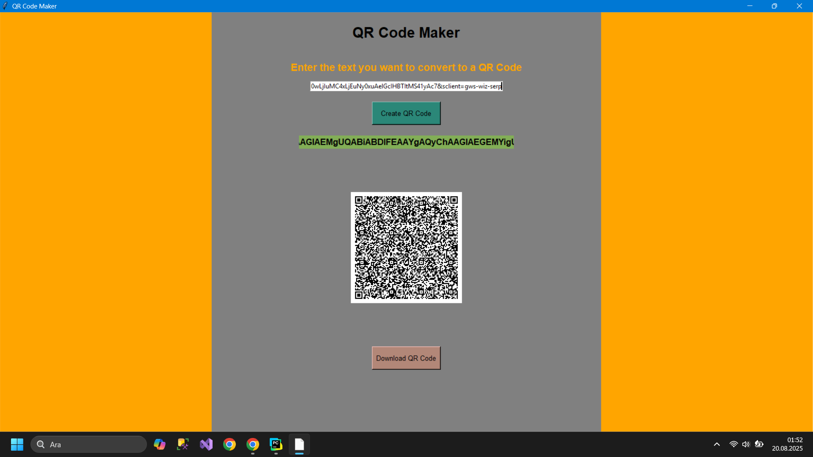

# QR Code Maker

##  English Version

**Project Name:** QR Code Maker  
**Language:** Python  
**Libraries Used:** `Tkinter`, `qrcode`, `Pillow`

### Description
QR Code Maker is a Python desktop application that allows users to easily create QR codes. Users can enter any text or link, generate a QR code, and download it as a PNG file. The interface is simple and intuitive, designed with Tkinter.

### Features
- Enter text to convert into a QR code
- QR code size automatically adjusts to the text length
- Displays the entered text above the QR code
- Scrollable canvas for large QR codes
- **Create QR Code** button generates the QR code
- **Download QR Code** button saves the QR code as a PNG
- Left and right panels for aesthetic design

### How to Use
1. Run the Python script
2. Enter the text you want to convert
3. Click **Create QR Code** to generate the QR code
4. The text and QR code will appear
5. Click **Download QR Code** to save it as PNG

### Requirements
- Python 3.x
- Libraries: `qrcode`, `Pillow`, `Tkinter` (Tkinter comes pre-installed)

********************************************************************************************************************************
********************************************************************************************************************************
********************************************************************************************************************************

##  Türkçe Versiyon

**Proje Adı:** QR Code Maker  
**Dil:** Python  
**Kullanılan Kütüphaneler:** `Tkinter`, `qrcode`, `Pillow`

### Açıklama
QR Code Maker, kullanıcıların kolayca QR kod oluşturmasını sağlayan bir masaüstü Python uygulamasıdır. Kullanıcılar metin veya link girip QR kod oluşturabilir ve PNG formatında indirebilir. Arayüz Tkinter ile basit ve kullanıcı dostudur.

### Özellikler
- QR koda çevirmek için metin girebilme
- Metin uzunluğuna göre QR kod boyutu otomatik ayarlanır
- QR kodun üstünde girilen metni gösterir
- Büyük QR kodlar için kaydırılabilir alan
- **Create QR Code** butonu ile QR kod oluşturma
- **Download QR Code** butonu ile PNG olarak kaydetme
- Sol ve sağ paneller ile estetik tasarım

### Kullanım
1. Python scriptini çalıştırın  
2. İstediğiniz metni girin  
3. **Create QR Code** butonuna tıklayın  
4. Metin ve QR kod ekranda görüntülenecek  
5. **Download QR Code** butonuna tıklayarak PNG olarak kaydedin  

### Gereksinimler
- Python 3.x  
- Kütüphaneler: `qrcode`, `Pillow`, `Tkinter` (Tkinter Python ile birlikte gelir)
